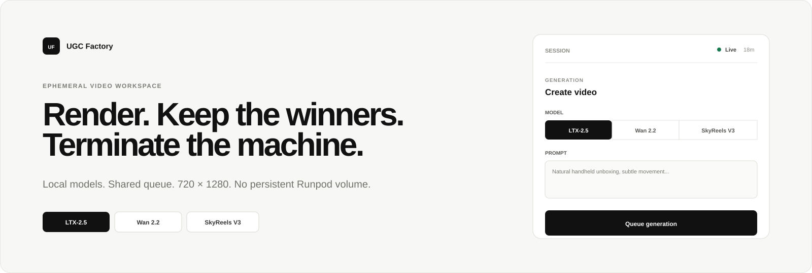
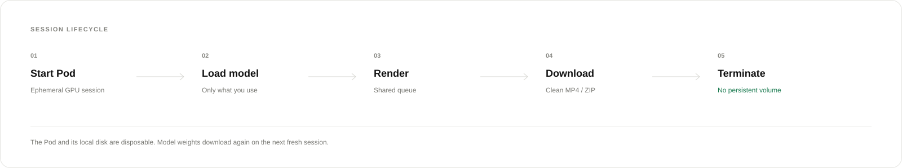

> **Development branch status (2026-09-30):** Safari-to-RunPod L40/LTX rendering, playback, download, archive and verified termination have been tested. The branch launcher pins the safety worker image. H3 remains authorization-gated and has not been GPU-tested. See [implementation evidence and remaining limits](docs/H3-IMPLEMENTATION.md). The legacy ephemeral-storage description below refers to the existing deployed image; new launcher backups require the matching updated worker.

<p align="center">
  
</p>

<p align="center">
  Self-hosted short-form video generation on ephemeral Runpod GPUs.
  <br>
  Local models. Shared queue. Clean vertical exports. No persistent Runpod volume.
</p>

<p align="center">
  <a href="#quick-start">Quick start</a> ·
  <a href="#models">Models</a> ·
  <a href="#two-person-workflow">Team workflow</a> ·
  <a href="#ending-a-session">Ending a session</a> ·
  <a href="#troubleshooting">Troubleshooting</a>
</p>

---

## What this is

UGC Factory is a small internal render workspace for high-volume short-form video testing.

It has one job:

> Start a temporary GPU, generate a lot of short vertical clips, keep the useful files, then terminate the machine.

It is intentionally not a full editing suite, social scheduler, credit system or permanent media library.

### V1

| Capability | Included |
|---|---:|
| LTX-2.5 | Yes |
| Wan 2.2 I2V | Yes |
| SkyReels V3 | Yes |
| Start / reference frame | Yes |
| Native end frame | LTX-2.5 |
| Duration | 4–10s where supported |
| Final output | 720 × 1280 |
| Batch queue | 1–100 variations |
| Shared workspace | Yes |
| MP4 metadata cleaning | Yes |
| ZIP export | Yes |
| Persistent Runpod volume | No |
| Persistent cloud history | No |

> [!IMPORTANT]
> The launcher requests no Runpod Network Volume. Model files, uploads, outputs and the local queue database exist only on the temporary Pod. Terminating the Pod deletes that local state.

---

## Session lifecycle

<p align="center">
  
</p>

The architecture is deliberately disposable.

```text
local launcher
    ↓
fresh Runpod Pod
    ↓
load selected model
    ↓
shared render queue
    ↓
720 × 1280 clean MP4
    ↓
download
    ↓
terminate Pod
```

The trade-off is simple:

- no persistent storage bill between sessions
- model weights download again on the next fresh session

---

# Quick start

The normal setup no longer requires shell exports.

## 1. Clone

```bash
git clone https://github.com/voekee/ugc-factory.git
cd ugc-factory
```

## 2. Start the local launcher

```bash
bash start.sh
```

On first run the script creates a small local Python environment, starts the onboarding app on `127.0.0.1`, and opens your browser automatically.

The browser setup explains:

1. where to paste your **Runpod API key**
2. where to paste your **Hugging Face token** for LTX-2.5
3. which GPU, session length and ephemeral disk to use
4. what is stored locally
5. what happens when the Pod is terminated

Keys can be remembered on this computer in:

```text
~/.ugc-factory/config.json
```

The file is created with owner-only permissions where the operating system supports them. It lives outside this Git repository.

> [!NOTE]
> “Saved locally” means the credentials are not committed to GitHub or saved in browser storage. Credentials required by a render session are still transmitted to the temporary Runpod Pod as environment variables for that session. The Pod is ephemeral and those values disappear with it when terminated.

## 3. Click Start GPU

The onboarding page creates the Pod and opens the render workspace automatically once the container responds.

The default session is:

| Setting | Default |
|---|---|
| Container | `ghcr.io/voekee/ugc-factory:latest` |
| GPU | NVIDIA GeForce RTX 5090 |
| Cloud | Community |
| Session | 5 hours |
| Ephemeral disk | 350 GB |
| Network Volume | none |

The onboarding page remembers those choices locally too.

## 4. First GPU test

Start small:

```text
Model        LTX-2.5
Duration     4 seconds
Variations   1
Start frame  one valid image
End frame    empty
```

Example prompt:

```text
Natural handheld smartphone footage. The person looks down at the package
and begins opening the top flap. Keep the movement small and realistic.
Normal indoor lighting, subtle camera movement, no cinematic motion.
```

Then scale:

```text
1 clip
→ verify
→ 10 clips
→ verify speed and quality
→ larger batches
```

## Advanced CLI

The old CLI still exists for automation and power users:

```bash
export RUNPOD_API_KEY='...'
export HF_TOKEN='hf_...'

python launcher/runpod_launcher.py \
  --image ghcr.io/voekee/ugc-factory:latest \
  --gpu 'NVIDIA GeForce RTX 5090' \
  --hours 5 \
  --disk 350 \
  --rate .99
```

# Workspace

The interface is deliberately small.

### Generation

Choose:

- creator
- model
- start / reference frame
- optional end frame where supported
- prompt
- duration
- number of variations

### Queue

Everyone in the same session writes into one shared queue.

One Pod in V1 represents one GPU, so jobs render sequentially.

### Library

Completed clips appear in the session library.

You can:

- preview a video
- download one MP4
- select several clips
- export selected clips as a ZIP

Nothing in the library is permanent after Pod termination.

---

# Models

## LTX-2.5

Recommended default.

Best fit in V1 for:

- many iterations
- short controlled movement
- first-frame and last-frame control
- 4–10 second shots

| Control | Support |
|---|---:|
| Start frame | Yes |
| End frame | Yes |
| Duration | 4–10s |
| Audio path | Available |
| Final export | 720 × 1280 |

The adapter uses the fast distilled pipeline.

---

## Wan 2.2 I2V A14B

Use it when you want a different motion or fidelity profile.

| Control | Support |
|---|---:|
| Start frame | Yes |
| End frame | No |
| Duration | 4–10s |
| Final export | 720 × 1280 |

The upstream checkpoint is large, roughly 126 GB.

With this project's ephemeral storage model, first use in every fresh Pod requires another download.

---

## SkyReels V3

Use it for reference-driven shots where subject or product consistency matters.

| Control | Support |
|---|---:|
| Reference frame | Yes |
| End frame | No |
| Duration | 5s |
| Resolution path | 720p |

The workspace only exposes controls that the selected adapter actually supports.

---

# Two-person workflow

Both people use the same dashboard URL and temporary session token.

Example:

```text
Mehmet
20 × LTX unboxing jobs

Joshua
20 × SkyReels reaction jobs
```

The queue keeps the creator attached to every job.

Your teammate needs:

- dashboard URL
- temporary session token

They do not need:

- `RUNPOD_API_KEY`
- `HF_TOKEN`

---

# Output pipeline

Every successful generation is finalized before it appears as a downloadable file.

```text
raw model output
       ↓
FFmpeg
       ↓
720 × 1280
H.264 / yuv420p
audio preserved when present
container metadata removed
chapters removed
       ↓
ExifTool
       ↓
clean MP4
```

The raw intermediate is deleted after the clean file is created.

This removes ordinary file and container metadata. It does not remove visible watermarks, perceptual fingerprints or metadata a social platform creates after upload.

---

# Ending a session

When you are finished:

1. Let active jobs finish.
2. Download every file you want to keep.
3. Click **Terminate Pod**.
4. Confirm.
5. The Pod and its local disk disappear.

Use **Terminate**, not merely Stop, if your goal is to leave no UGC Factory Pod storage behind.

```text
render
  ↓
download
  ↓
terminate
  ↓
Pod deleted
local disk deleted
no Network Volume
```

## Termination guard

Normal termination is blocked while:

- jobs are queued
- a job is rendering
- a job is being finalized
- completed outputs remain marked undownloaded

Force termination is available, but anything left only on that Pod is lost.

## Runtime watchdog

```bash
bash launcher/start.sh --hours 5
```

starts a maximum-runtime watchdog.

It exists to prevent an accidentally forgotten GPU from running indefinitely.

Download important outputs before the deadline.

---

# Cost model

There are no per-generation application credits.

The main cost is the Runpod session itself:

```text
GPU price per hour
×
time the Pod exists
```

UGC Factory deliberately does not keep a Network Volume or permanent model cache.

That makes it most useful for concentrated sessions:

```text
prepare frames first
→ start GPU
→ render for a few hours
→ download
→ terminate
```

instead of repeatedly starting a GPU for a single clip.

---

# Recommended workflow

Before launching Runpod:

1. Prepare your start frames.
2. Prepare prompts.
3. Decide which shots need end frames.
4. Keep the actual GPU session focused on inference.

During the session:

1. Render one LTX test.
2. Queue 10 variants.
3. Check quality.
4. Scale the batch.
5. Use Wan or SkyReels only when their strengths are useful.
6. Download good outputs continuously.
7. Terminate when finished.

Short shots are easier to control than asking one generation to carry an entire ad.

---

# Local development

You can test the complete application flow without a GPU.

Requirements:

- Python 3.11+
- FFmpeg
- ExifTool

```bash
python3 -m venv .venv
source .venv/bin/activate
pip install -r requirements.txt
cp .env.example .env
```

Set:

```text
APP_ACCESS_TOKEN=dev
UGC_RENDERER_MODE=mock
```

Run:

```bash
uvicorn app.main:app --reload --port 8000
```

Open:

```text
http://localhost:8000
```

Enter token:

```text
dev
```

The mock renderer creates placeholder MP4s so the queue, finalization, library, ZIP export and termination guard can be tested without CUDA.

---

# Tests

```bash
pytest -q
python -m compileall app launcher tests
bash -n scripts/*.sh launcher/start.sh
node --check static/app.js
```

CI covers:

- renderer capabilities
- multi-user queue
- output normalization
- metadata removal
- preview
- ZIP export
- download-state tracking
- termination guard
- mock end-to-end flow

---

# Troubleshooting

## Runpod cannot pull the image

Check:

1. **Actions → Build container** completed successfully.
2. The GHCR package exists.
3. The package is public, or Runpod has registry credentials.

Do not solve this by committing a GitHub token.

---

## LTX returns Hugging Face 401 / 403

Check:

1. your account has model access
2. your token has read permission
3. you exported `HF_TOKEN` before starting the Pod

Then create a fresh session.

---

## RTX 5090 is unavailable

Pass another compatible Runpod GPU type:

```bash
bash launcher/start.sh \
  --gpu 'YOUR RUNPOD GPU TYPE' \
  --hours 5 \
  --disk 350
```

Availability changes over time.

---

## First generation takes a long time

Expected on a fresh Pod.

First use can include:

- cloning pinned renderer code
- setting up renderer dependencies
- downloading model weights
- loading the model

Later jobs using the same renderer in the same session reuse those local files.

---

## Wan consumes a lot of disk

Expected.

Its checkpoint is large.

If you intentionally load several large renderers in the same session, increase the ephemeral disk:

```bash
bash launcher/start.sh --disk 450 --hours 5
```

Check your selected Runpod resource pricing before doing so.

---

## Termination is blocked

Make sure:

- the queue is empty
- nothing is rendering or finalizing
- completed outputs you want have been downloaded

Then terminate again.

---

# Security

Never commit:

```text
RUNPOD_API_KEY
HF_TOKEN
APP_ACCESS_TOKEN
```

`.env` is ignored by Git.

The temporary dashboard token is meant to be shared only with people who should use that session.

Terminate the Pod and the session-local database, model cache, inputs and outputs disappear with it.

---

# Reproducibility

Renderer source is pinned instead of pulling a moving branch at inference time.

| Renderer | Revision |
|---|---|
| LTX-2 | `a95ab856bf29407b6b066ede0abe1846050db56c` |
| Wan 2.2 | `1ea34ff48f87168174e12956e200b1d908b1c5ff` |
| SkyReels V3 | `28c771e8456341be6a213e3d1133ed1fd19bf75d` |

Model checkpoints still come from their upstream repositories.

---

# Architecture

```text
Dashboard / Queue
       │
       ▼
Renderer adapter
       │
  ┌────┼────┐
  ▼    ▼    ▼
 LTX  Wan  SkyReels
```

A future renderer can be added without redesigning the queue, metadata finalizer or Runpod lifecycle.

---

# Scope

V1 intentionally does not include:

- payments
- accounts
- persistent cloud history
- persistent model storage
- multi-GPU scheduling
- editing timeline
- automatic social publishing
- paid external generation APIs

The product stays narrow on purpose.

**Start the GPU. Render. Keep what is useful. Terminate.**

---

## License

Application code is MIT licensed.

Model weights are not redistributed by this repository. Review each upstream model's current license and access terms before use, especially for commercial work.
